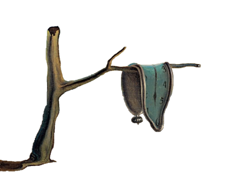

# Dal&iacute; 2.5D
### Bewegungsparallaxe in der Webprogrammierung

Roland Bruggmann, 2012

##### Beschreibung
Salvador Dal&iacute;s 'La persistencia de la memoria' als Bewegungsparallaxe.

##### Stichworte
- Bewegungsparallaxe, 2.5D
- Salvador Dal&iacute;
- Bildbearbeitung mit GIMP
- Markup HTML, CSS
- Programmiersprachen PHP, JavaScript

##### Bibliothek
- <a target="_blank" href="https://github.com/stephband/jparallax">jParallax</a>, jQuery-Bibliothek von Stephen Band.

##### Online
- <a target="_blank" href="http://about.geogeek.ch/parallax/persistencia.html">Dal&iacute; 2.5D</a>

Bild: © 2005 Salvador Dalí, Gala-Salvador Dalí Foundation/Artists Rights Society (ARS), New York.
